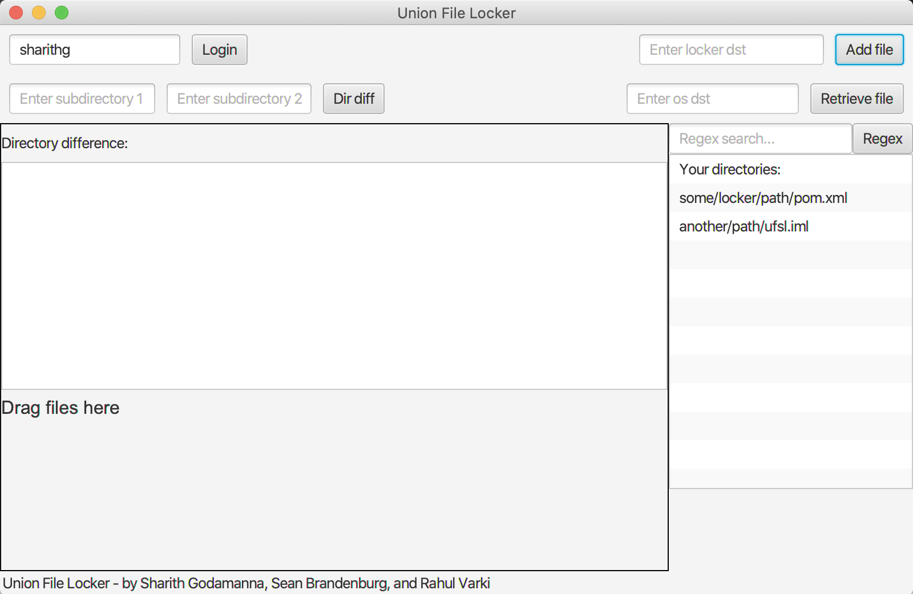

Created By:  Rahul Varki,Sean Brandenburg, Sharith Godamanna

# Documentation  
  The Union File System Locker is an application that at a basic level acts like a normal computer's directory system. A user can 
  logically separate files into users, folders, subfolders, etc. The UFSL also allows user to serialize the entire system into a single 
  file where it can then be moved and reloaded somewhere else with the same data and structural information. The UFSL aims to save space
   by de-duplicating files that appear multiple times in the directory (i.e a file belonging to user1 containing "abc" and a file 
   belonging to user2 containing "abc" will only be stored one time).

Our directory system is stored as a tree structure where each node is a folder, which can contain data, as well as other folders. 
The data from a file is stored in a wrapper known as a fileContainer which contains the actual data from the file, as well as metadata 
that allows the system to more quickly perform other important operations. The basic strategy we use to achieve the Union functionality 
without prohibitively long runtimes, is to create a cheap hash(constant runtime) based on random samples from the input file. We then use
 these cheap hashes as keys to a hashmap with a linkedlist of fileContainers as the value. In this way, every time a new file is added 
 with this same hash, it has a hopefully short list of files with a matching hash which it does a full comparison against. If it is 
 identical, it then notes that it is a reference and adds a reference to the identical file that is called upon whenever the new object's
  data is accessed. This also creates some issues with removing files that are handled by allowing the object to know the directories of 
  all of the files that point at it so that in the event the original is removed, all of the pointers can be rearranged to point at one 
  of the other files.

## Implemented Features

 - Adding, removing, listing, and retrieving items from the locker
	 - In order to add an element (not considering any of the other features that need to perform ops here) is done by simply looking 
	 at the input directory, and continually creating new files or going into children files as the path specifies, and adding a new 
	 file in that folder. There is some additional complexity here which will be referenced in other feature sections
	 - To remove elements we do the same traversal as in add and simply remove the element from that folder. Again there is additional complexity here that will be addressed in other features
	 - Retrieving items is done by again performing a traversal, then reading the data held in the proper file out into a file
	 - listing is done by doing a recursive dfs traversal of the tree and adding encountered items to a return string
 - Size reduction based on "Unioning" identical files anywhere in the system
	 - In order to implement this feature we first perform a cheap hash based on random samples on the data of each file, then add it to a
	  hashTable with the hash as the key and a linkedlist of file containers as the value. By doing this we are able to eliminate a 
	  significant number of comparisons and only make full file comparisons between a small number of files that hash to the same key. 
	  Newly added files that find other files with their data become pointers to these other files. If the file that is being pointed 
	  at by the other files is removed, the pointers need to be rearranged in order to make sure that their data is still accessible. 
	  We do this by storing the path to the files that point at the primary file and at random choosing a new file to be the new primary.
	   All of the pointers are then adjusted to point at the new primary. We have also thought about doing this lazily by just making the 
	   primary a zombie fileContainer that gets pointed at but does not actually exist. This however would add unwanted additional 
	   complexity to other operations and would result in longer latency for other arguably more important operations.
- Compression of our serialized object
	- We explored a variety of compression libraries but deemed that compression was not a good fit for our application as it added 
	significant latency to using the application with command line arguments as the locker needs to be loaded,uncompressed,re-compressed 
	and written back to disk after each operation. This alone would easily break the efficiency gurantees required for the minimum product.
	Since then we have added a no arguments mode which allows you to continuously enter commands without reloading the locker which may
	 allow us to consider compression again as the compression would result in a one time delay at startup and shutdown. As we are unsure 
	 how a typical user would use this locker we are unable to say for certain whether compression is or isn't a good idea but for now we
	 have chosen to go without it.
- Basic GUI
	- Gives a less complicated user experience and makes it more intuitive for the user
	- User can see their files being changed on the fly
<<<<<<< HEAD
	 
	 - Usage instructions:
	   - First log in with a existing or new username
	   - To add a new file, drag and drop file into the bottom left window, enter the locker destination, and add the file
	   - To retrieve a file, select the desired file from the list of files, enter the OS destination (must be absolute path: ex - Users/username/...), and retrieve the file
	   - To perform directory differencing, enter both paths (With the username)
	   - To do regex search, search the reg expression. To get the files list back, search the regex as an empty field
- Efficiently handle similarities between similar binaries and images
	- We were able to get the similar images working but unfortunately it is a bit unstable. We have decided to leave the code and tests commented out in order to preserve the functionality of the rest of our system. Basic adding, retrieving, listing all work with images, but removing and sometimes directory differencing don't behave properly. Java's ImageIO seemed to have varying success with reading in files, even of the same type. The previously listed commands work for any file that we were able to successfully read into an ImageIO object (all of the ones in the test directory should work). Our approach to this was to use a similar cheap hash to the one we use for cheap checks with normal files. Instead we hash a random sample of pixel values and use these samples to identify similar images. We then do a scan over the existing image and the new image and determine whether or not they are similar enough for it to be efficient to store their differences. If they are, 1 image will point at the other and keep track of the individual pixels that it has different from the original, reading out the reference image with its new pixels replacing the old ones as needed. 
=======
	- We were able to create a GUI with javafx that handles all of our cli supported instructions
- Efficiently handle similarities between similar binaries and images (UNSTABLE)
	- We were able to get the similar images working but unfortunately it is a bit unstable. We have decided to leave the
	 code and tests commented out in order to preserve the functionality of the rest of our system. Basic adding, retrieving, 
	 listing all work with images, but removing and sometimes directory differencing don't behave properly. Java's ImageIO seemed 
	 to have varying success with reading in files, even of the same type. The previously listed commands work for any file that 
	 we were able to successfully read into an ImageIO object (all of the ones in the test directory should work). Our approach 
	 to this was to use a similar cheap hash to the one we use for cheap checks with normal files. Instead we hash a random sample 
	 of pixel values and use these samples to identify similar images. We then do a scan over the existing image and the new image 
	 and determine whether or not they are similar enough for it to be efficient to store their differences. If they are, 1 image 
	 will point at the other and keep track of the individual pixels that it has different from the original, reading out the reference 
	 image with its new pixels replacing the old ones as needed. This approach is admittedly a bit naive and only works on images of the same
	 size and with at most 1/12th of the picture being different, but it is quite effective on images with noise similar to that seen in the test
	 images provided. Our test shows that we can store 3 similar noisy images with only about 1.3 times as much space as the initial
	 image alone. We ended up doing directory differencing rather than handling similar binaries.
	 
	 - IF YOU'D LIKE TO TEST IMAGE SIMILARITY UNCOMMENT LINES 83 & 84 OF directoryStructure.java and line 243 of AppTest.java. Only png images that
	 are capable of being read by ImageIO.read() are handled by our implementation. The approach should work equally well on other image types
	 but ImageIO seems to struggle with them.
	 
- Regex searching
    * In order to implement this feature we perform a non-recursion based DFS search on our tree directrory structure to visit all the files in the locker. If the file is not a reference file (i.e either no other file has the same contents or this file is "the original file" that other files with the same contents point to) then its contents are matched against the regular expression (regex) that is given. If there is a match between the given regex and the contents of the file, then the filepaths of this file and the files that reference it are provided to the user.  
- Unioning entire directories
	- Our system does do this, but it is not logically done as directory unions. We did begin to implement this (logically as entire directory unioning) with hashes of the contents of each file for identifying similar directories, but were seeing essentially zero(or worse than without directory unioning) space savings as metadata about directory and file names still needed to be maintained and we actually needed even more metadata to associate directories with their counterparts in the unioned directory because we do not require that files have the same name to be unioned.
- Sub-directory differencing (added but not in our midterm test report)
	- We handle sub directory differencing by using the reference system that we already established for handling unions.
	 We perform a dfs traversal of the tree starting at the specified subdirectory and check if any of them point at something 
	 or are pointed at by something in the other subdirectory. If they aren't we add them to the return list, and if they are we 
	 ignore them.

## Use Instructions
    -user 
      Usage: -user [username] (Required for all flags except --regex,
      --dirDif, --GUI) 
      
    --addFile
      Usage: -user [username] --addFile [osFilePath] [ufsFilePath] (Note: The 
      osFilePath must be an absolute filepath). It adds the file from the OS 
      path to the virtual path that is specified, maintaining the orignal name
      of the file. 
      
    --retrieve
      Usage: -user [username] --retrieve [ufsFilePath] [osFilePath] (Note: The 
      osFilePath must be an absolute filepath). It retrieves the file at the 
      virtual path and deposits it at the specified OS filepath.
      
    --remove
      Usage: -user [username] --remove [ufsFilePath]. It removes the file at 
      the virtual filepath specified.
      
    --list
      Usage: -user [username] --list. Lists all the files stored for the user.
      Default: false
      
    --lockerName
      Usage: Input the name of the locker. Can be appended to any command when 
      passed as an argument, or passed alone to start an interactive session on
      a specific locker. Once inside of an interactive session, the locker can not
      be changed.
      Default: locker.data
      
    --regex
      Usage: --regex [regex]. Input the regular expression [regex] that you 
      want to search for in the files of the locker. It returns the file paths 
      of all the files whose CONTENTS contain the expression assuming files are encoded in UTF-8.
      Does not match file names. Searches the entire locker. Cannot be paired with -user 
      or a specific file path.
      
    --dirDif
      Usage: --dirDif [ufsFilePath] [ufsFilePath]. Returns all files that are in only
      one of the two paths by CONTENTS (ignores naming). Is not used with the user flag,
      as users are specified in the paths (See examples below)
      
    --GUI
      Usage: --GUI. Opens the GUI
      Default: false
      Can only be called from interactive mode. If you close the window you must re-run to 
      open the GUI again. Cannot be combined with any other flags. First run the program
      with no arguments, then run --GUI.
     
## Examples
 * **No Params**
    * The user may enter commands back to back ("Interactive Mode") without reloading the locker after each instruction. Defaults to using a locker named locker.data. Can not change specify --lockerName flag in interactive mode. Must be specified as an initial parameter
 * "--lockerName myLocker.data"
    * launches in interactive mode but loads from and saves to myLocker.data. Once you've launched interactive mode, you can no longer specify a new locker.
 * "-user user1 --addFile a/path/on/my/OS/file.txt made/up/virtual/path/in/locker"    
    * File is added to the virtual path as file.txt. The locker used is locker.data
 * "-user user1 --addFile a/path/on/my/OS/file.txt made/up/virtual/path/in/locker --lockerName newLocker.data"    
    * File is added to the virtual path as file.txt. The locker used is newLocker.data
 * "-user user1 --retrieve made/up/virtual/path/in/locker/file.txt a/path/on/my/OS"   
    * File will be written back to the OS as file.txt
 * "-user user1 --remove made/up/virtual/path/in/locker/file.txt"                     
    * Removes the given file*
 * "-user user1 --list"                                                               
    * Lists all the files belonging to a user
 * --dirDif user1/path/to/folder user2/path/to/folder                                 
    * Prints the differences between the contents of the folders by contents not name
 * --regex gr[ae]y                                                        
    * Returns files whose CONTENTS contains "grey" or "gray". Interprets contents assuming UTF-8 encoding
 * "--GUI"
    * launches with the interactive GUI (Cannot be combined with other flags or can only be used once per session from interactive mode)
        
#### Note: To run from command line with the precompiled jar file, run ./ufsl in the group4 folder followed by one of these commands
* i.e) ./ufsl -user me --addFile myFile/text.txt myPath

## Tests
* BasicFunctionalitySystemTest: test adding a file, retrieving the file and removing the file
* dirDifferenceSystemTest: tests finding the difference between two directories by CONTENTS of files(not by name)
* ListSystemTest: tests listing the current contents of the system
* RegexSystemTest: ensures that the --regex flag returns only the files that match the input expression
* ImageSimilarityTest (Uncomment line 243 in AppTest and 83-83 in directoryStructure to run): Our image similarity unioning is a bit unstable with certain commands but works for adding(with unioining) and retrieving images with noise. This test adds 1 original image, 1 image with a bit of noise, and one image with a lot of noise, then makes sure that the size of the resulting locker is less than 2* the size of the original image (No entirely new images are stored)
* UnionSizeReductionBenchmark: tests that adding two identical files does not increase the size of the locker by 2* the size of the original file
* InstructionBenchmarkTest: benchmarks running many operations to make sure they can still complete quickly. The stringLength final int at the start of the test can be adjusted to make the data larger or smaller but the entirety of the locker must fit within the space you have allocated to java for your heap.

## Work Breakdown
 - Sharith Godamanna
     - Wrote tests for list system and union efficiency
     - Implemented GUI for the Union File System
     - Created file container for individual files
     - Serialized files and data structures
     
 - Sean Brandenburg
	 - Implemented file directory structure and folder/file objects
	 - Implemented file manipulation ops (addFile,removeFile,retrieveFile)
	 - Implemented list command
	 - Implemented system for unioning files
	 - Implemented directory differencing 
	 - Implemented Image similarity
	 - Integrated JCommander with directory system
	 - Wrote tests for directory differencing, basic functionality,regex,image similarity and instruction runtime benchmark 

- Rahul Varki
    -  Implemented JCommander for command line parsing of arguments
    -  Implemented regex command 
    -  Implemented OS file checker 
    -  Researched potential lossless compression libraries to be used in the project. 

## Notes

- Please use Java 8 to test GUI
- If your path starts with '/' it will be treated as an absolute file path. If it does not the file path will start from the root directory of the proejct. '~' can not be used to start from the home directory.

